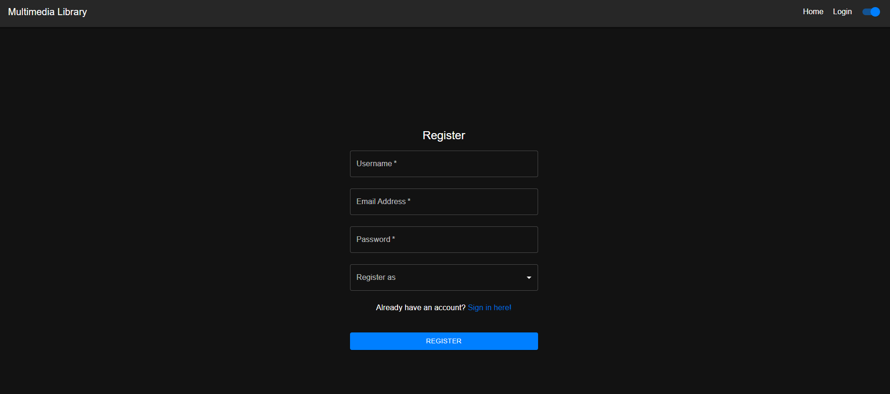
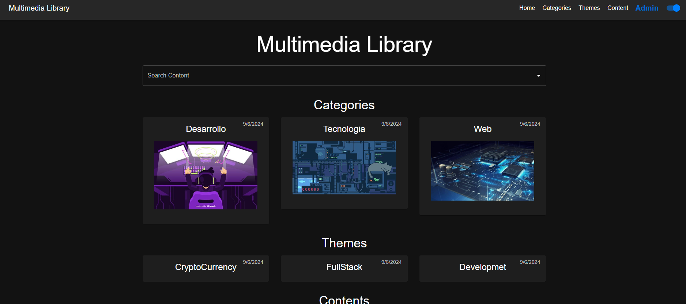
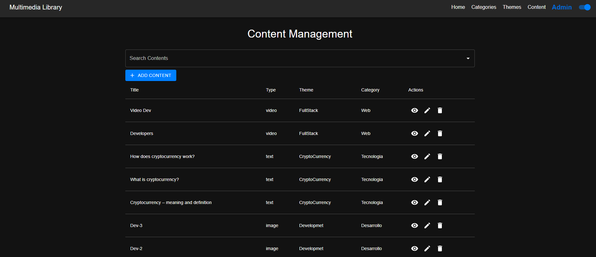
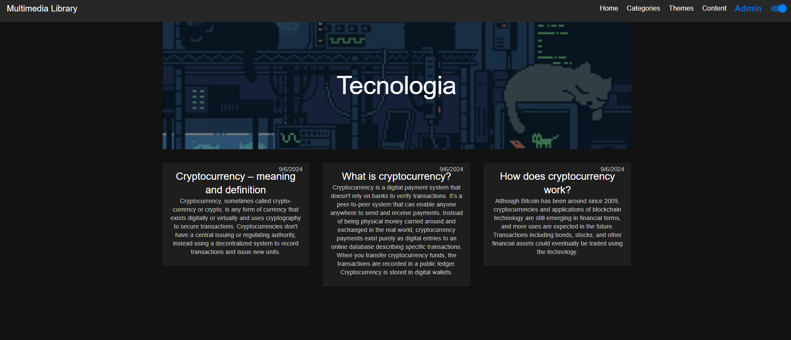

# Management Multimedia Content Frontend

## Project Structure

```plaintext
management-multimedia-content-frontend/
├── node_modules/
├── public/
│   ├── index.html
│   ├── favicon.ico
│   └── manifest.json
├── src/
│   ├── components/
│   │   ├── Auth/
│   │   │   ├── Login.js
│   │   │   ├── Register.js
│   │   ├── Content/
│   │   │   ├── ContentList.js
│   │   │   ├── ContentDetail.js
│   │   ├── Navbar/
│   │   │   ├── Navbar.js
│   ├── guard/
│   │   ├── AuthGuard.js
│   ├── pages/
│   │   ├── Home.js
│   │   ├── Categories.js
│   │   ├── Themes.js
│   │   ├── Content.js
│   ├── services/
│   │   ├── AuthService.js
│   │   ├── ContentService.js
│   │   ├── CategoryService.js
│   │   ├── ThemeService.js
│   ├── theme/
│   │   ├── dark.js
│   │   ├── light.js
│   ├── App.css
│   ├── App.js
│   ├── App.test.js
│   ├── index.css
│   ├── index.js
│   ├── logo.svg
│   ├── reportWebVitals.js
│   ├── setupTests.js
├── .gitignore
├── package-lock.json
├── package.json
├── README.md
```

## Installation and Setup

1. **Clone the repository**:

   ```bash
   git clone https://github.com/kaikrmen/Multimedia-Frontend.git
   cd multimedia-content-management-frontend
   ```

2. **Install dependencies**:

   ```bash
   npm install
   ```

3. **Create a `.env` file and add the necessary environment variables**:

   ```makefile
   REACT_APP_API_URL=http://localhost:5000/api/v1
   ```

4. **Run the application**:

   ```bash
   npm start
   ```

5. **Build the application for production**:

   ```bash
   npm run build
   ```

6. **Run tests**:

   ```bash
   npm test
   ```

## Project Overview

### Components

- **Auth**: Handles user authentication (Login and Register).
- **Content**: Displays content list and content details.
- **Navbar**: Provides navigation across different pages.
- **Guard**: Contains authentication guard for protected routes.
- **Services**: Contains API services for authentication, content, categories, and themes.
- **Theme**: Contains dark and light theme configurations.

### Pages

- **Home**: Displays the homepage.
- **Categories**: Lists all categories.
- **Themes**: Lists all themes.
- **Content**: Lists all content and content details.

## Key Features

### Authentication

- **Login and Register**: Allows users to log in and register. Validates that usernames and emails are unique.

### User Roles

- **Admin**: Can perform all CRUD operations on users, categories, themes, and contents.
- **Creator**: Can create, read, and update contents.
- **Reader**: Can read contents.

### Content Management

- **CRUD Operations**: Admin can create, read, update, and delete categories, themes, and contents.
- **Role-based Access**: Content creation and management are restricted based on user roles.

### Theming

- **Dark and Light Mode**: Users can switch between dark and light modes.

### Content Display

- **Library View**: Displays contents categorized by type and theme. All users can view the content list, but only registered users can access detailed content.
- **Search**: Allows users to search for content by name or theme.

### Validation

- **Unique Usernames and Emails**: Ensured during user registration.
- **Content Type Validation**: Ensures that the correct type of content is uploaded according to its category.
- **Access Control**: Validates user permissions for accessing and managing content.

## Detailed File Descriptions

### `src/components/Auth/Login.js`

Handles user login.

### `src/components/Auth/Register.js`

Handles user registration.

### `src/components/Content/ContentList.js`

Displays a list of contents.

### `src/components/Content/ContentDetail.js`

Displays detailed view of a specific content.

### `src/components/Navbar/Navbar.js`

Provides navigation links to different pages.

### `src/guard/AuthGuard.js`

Ensures that only authenticated users can access protected routes.

### `src/pages/Home.js`

Displays the homepage with general content information.

### `src/pages/Categories.js`

Lists all content categories.

### `src/pages/Themes.js`

Lists all content themes.

### `src/pages/Content.js`

Displays all contents and their details.

### `src/services/AuthService.js`

Handles API requests related to user authentication.

### `src/services/ContentService.js`

Handles API requests related to content management.

### `src/services/CategoryService.js`

Handles API requests related to category management.

### `src/services/ThemeService.js`

Handles API requests related to theme management.

### `src/theme/dark.js`

Defines the dark theme configuration.

### `src/theme/light.js`

Defines the light theme configuration.

### `src/App.js`

Main application component that sets up routing and theming.

### `src/index.js`

Entry point for the React application.

### `public/index.html`

Main HTML file.

## Running the Project

1. **Start the backend server** (assuming the backend is set up according to the previously provided documentation).

2. **Start the frontend development server**:

   ```bash
   npm start
   ```

3. **Open the application in your browser**:

   Navigate to `http://localhost:3000` to view the application.

4. **Switch between dark and light modes** using the toggle switch in the navbar.

## Additional Information

### Dependencies

- **@mui/material**: For UI components.
- **@mui/icons-material**: For icons.
- **axios**: For making API requests.
- **jwt-decode**: For decoding JWT tokens.
- **react-router-dom**: For routing.
- **react-toastify**: For notifications.
- **@testing-library/react**: For testing.

### Scripts

- **start**: Runs the application in development mode.
- **build**: Builds the application for production.
- **test**: Runs tests.
- **eject**: Ejects the application from `create-react-app`.

## Example Usage

### Registering a User

1. Navigate to the **Register** page.
2. Fill in the **Username**, **Email Address**, **Password**, and **Role**.
3. Click **Register**.

### Logging in

1. Navigate to the **Login** page.
2. Enter your **Email Address** and **Password**.
3. Click **Login**.

### Managing Content

1. Log in as an **Admin** or **Creator**.
2. Navigate to the **Content** page.
3. Create, read, update, or delete content based on your role permissions.

## Images







